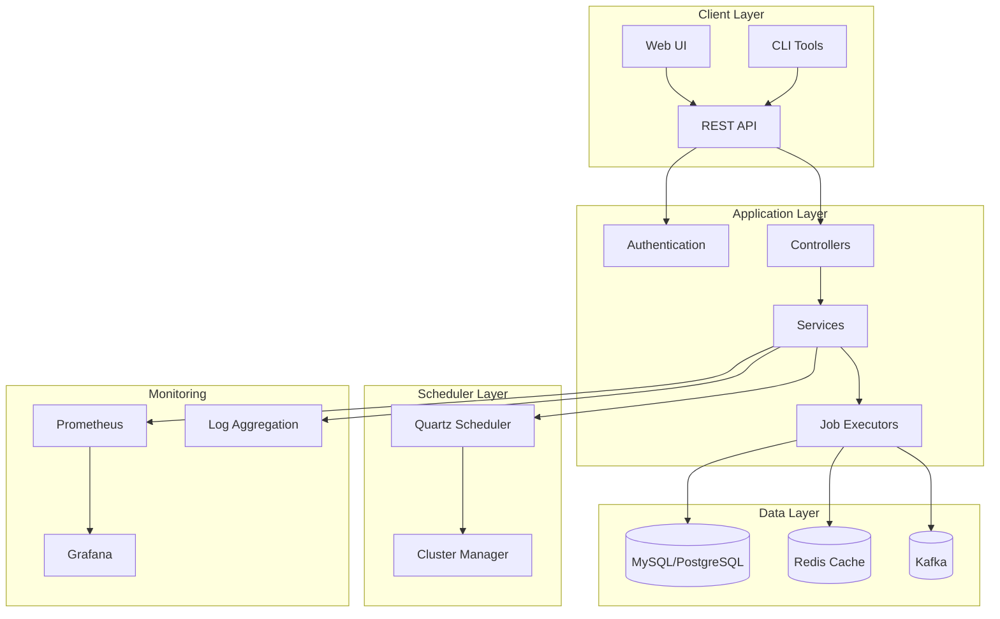
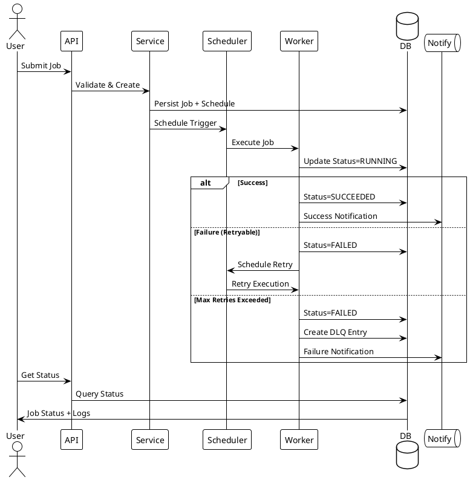

# 🚀 Chronos - Enterprise Job Scheduling System

[](https://openjdk.java.net/projects/jdk/21/)
[](https://spring.io/projects/spring-boot)
[](LICENSE)
[](#)

Chronos is a **production-grade distributed job scheduling system** built with modern Java and Spring Boot. It provides reliable execution, comprehensive management, and advanced monitoring of one-time and recurring jobs with enterprise-level features.

## 🎯 Key Features

### 🔧 **Job Management**
- **Multiple Job Types**: HTTP, Database, File System, Message Queue, Cache, Email, Reports
- **Flexible Scheduling**: One-time, CRON expressions, interval-based
- **Job Lifecycle**: Create, pause, resume, cancel, delete with full audit trail
- **Priority Queuing**: HIGH, MEDIUM, LOW priority job execution
- **Retry Policies**: Configurable retry with exponential/fixed backoff

### 🔒 **Security & Authentication**
- **JWT-based Authentication**: Secure token-based access
- **Role-based Access Control**: USER and ADMIN roles
- **API Security**: Protected endpoints with proper authorization
- **Audit Logging**: Complete user action tracking

### 📊 **Monitoring & Observability**
- **Prometheus Metrics**: Job execution statistics and performance
- **Health Checks**: System health and cluster status
- **Execution Logs**: Detailed job execution tracking
- **Grafana Dashboards**: Real-time monitoring and alerting

### 🏗️ **Enterprise Architecture**
- **Horizontal Scaling**: Quartz clustering support
- **High Availability**: Distributed execution with failover
- **Database Support**: MySQL, PostgreSQL with connection pooling
- **Message Queues**: Kafka and RabbitMQ integration
- **Caching**: Redis integration for performance

## 🏗️ System Architecture

### High-Level Architecture


### Component Overview
- **REST API**: RESTful endpoints with OpenAPI documentation
- **Authentication**: JWT-based security with role-based access
- **Job Executors**: Pluggable execution engines for different job types
- **Quartz Scheduler**: Enterprise-grade job scheduling with clustering
- **Monitoring**: Comprehensive observability with Prometheus and Grafana

### Job Execution Flow



## 🚀 Getting Started

### Prerequisites

- Java 21
- Docker & Docker Compose
- Maven 3.8+

### Local Development Setup

1. Clone the repository:
   ```bash
   git clone https://github.com/your-org/chronos.git
   cd chronos
   ```

2. Start infrastructure services:
   ```bash
   make up
   ```

3. Run the application:
   ```bash
   ./mvnw spring-boot:run -Dspring.profiles.active=local
   ```

4. Access the API documentation:
   - OpenAPI UI: http://localhost:8080/swagger-ui.html
   - API Docs: http://localhost:8080/v3/api-docs

### Environment Variables

| Variable | Description | Default |
|----------|-------------|---------|
| `SPRING_DATASOURCE_URL` | PostgreSQL connection URL | `jdbc:postgresql://localhost:5432/chronos` |
| `SPRING_DATASOURCE_USERNAME` | Database username | `chronos` |
| `SPRING_DATASOURCE_PASSWORD` | Database password | `chronos` |
| `JWT_SECRET_KEY` | JWT signing key (Base64) | Generated in local profile |
| `QUARTZ_CLUSTERED` | Enable Quartz clustering | `false` in local |

## 📡 API Overview

### Authentication

```bash
# Register a new user
curl -X POST http://localhost:8080/api/v1/auth/register \
  -H "Content-Type: application/json" \
  -d '{"email":"user@example.com","password":"secret"}'

# Login and get JWT token
curl -X POST http://localhost:8080/api/v1/auth/login \
  -H "Content-Type: application/json" \
  -d '{"email":"user@example.com","password":"secret"}'
```

### Job Management

```bash
# Create a one-time job
curl -X POST http://localhost:8080/api/v1/jobs \
  -H "Authorization: Bearer $TOKEN" \
  -H "Content-Type: application/json" \
  -d '{
    "name": "Sample HTTP Job",
    "type": "HTTP",
    "schedule": {
      "type": "ONCE",
      "runAt": "2023-12-25T10:00:00Z"
    },
    "payload": {
      "httpUrl": "https://httpbin.org/get",
      "httpMethod": "GET"
    },
    "retryPolicy": {
      "maxAttempts": 3,
      "backoffStrategy": "EXPONENTIAL",
      "backoffSeconds": 60
    }
  }'

# Create a recurring job
curl -X POST http://localhost:8080/api/v1/jobs \
  -H "Authorization: Bearer $TOKEN" \
  -H "Content-Type: application/json" \
  -d '{
    "name": "Daily Report",
    "type": "HTTP",
    "schedule": {
      "type": "CRON",
      "cronExpr": "0 0 12 * * ?"
    },
    "payload": {
      "httpUrl": "https://api.internal/generate-report",
      "httpMethod": "POST"
    }
  }'
```

## 📊 Monitoring

### Metrics

Available at `/actuator/prometheus`:

- `chronos_jobs_total{status}`
- `chronos_runs_duration_seconds`
- `chronos_retries_total`
- `chronos_queue_depth`

### Health Checks

Available at `/actuator/health`:

- Database connectivity
- Quartz scheduler status
- Disk space
- Application status

## 🧪 Testing

```bash
# Run all tests (unit + integration)
./mvnw verify

# Run only unit tests
./mvnw test

# Run integration tests
./mvnw verify -P integration-test
```

## 📦 Deployment

### Docker

```bash
# Build image
docker build -t chronos .

# Run container
docker run -p 8080:8080 \
  -e SPRING_PROFILES_ACTIVE=prod \
  -e SPRING_DATASOURCE_URL=jdbc:postgresql://db:5432/chronos \
  chronos
```

### Production Checklist

- [ ] Configure secure JWT secret
- [ ] Enable Quartz clustering
- [ ] Set up monitoring (Prometheus + Grafana)
- [ ] Configure email/webhook notifications
- [ ] Set appropriate retry policies
- [ ] Enable rate limiting
- [ ] Configure CORS for web UI

## 📚 Documentation

- [API Documentation](http://localhost:8080/swagger-ui.html)
- [Database Schema](docs/schema.md)
- [Security Guide](docs/security.md)
- [Operations Guide](docs/ops.md)

## 🤝 Contributing

1. Fork the repository
2. Create a feature branch
3. Commit your changes
4. Push to the branch
5. Create a Pull Request

## 📝 License

This project is licensed under the MIT License - see the [LICENSE](LICENSE) file for details.
