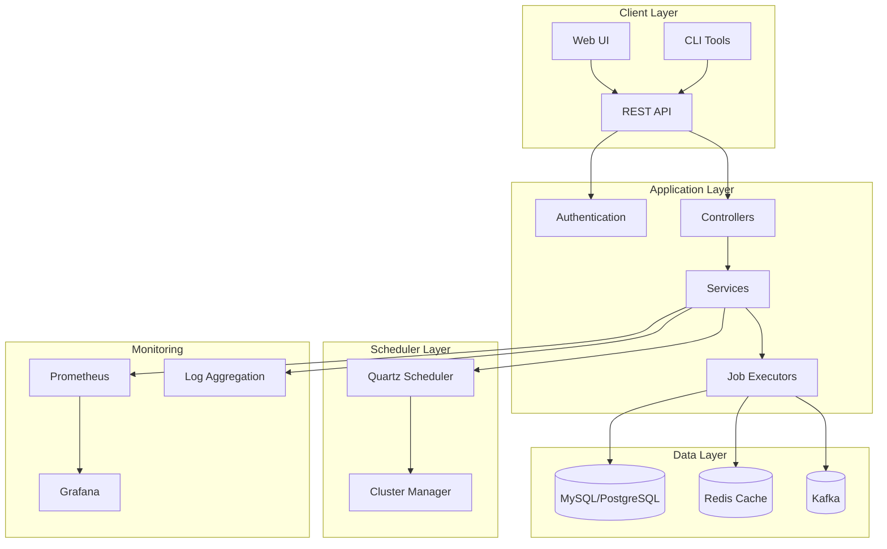
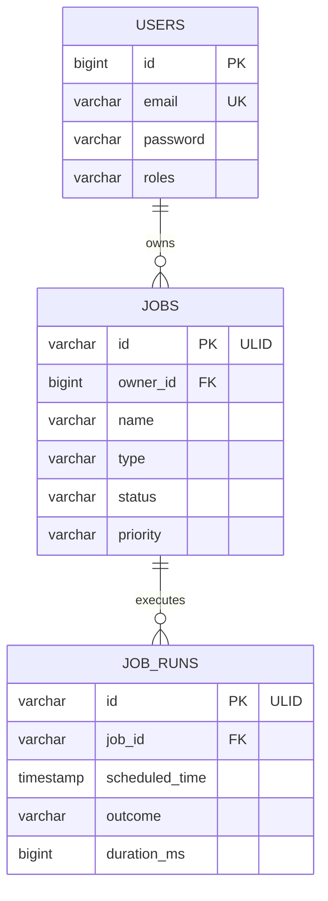

# 🚀 Chronos - Enterprise Job Scheduling System

[](https://openjdk.java.net/projects/jdk/21/)
[](https://spring.io/projects/spring-boot)
[](LICENSE)
[](#)

Chronos is a **production-grade distributed job scheduling system** built with modern Java and Spring Boot. It provides reliable execution, comprehensive management, and advanced monitoring of one-time and recurring jobs with enterprise-level features.

## 📋 Table of Contents

- [🎯 Key Features](#-key-features)
- [🏗️ System Architecture](#️-system-architecture)
- [🚀 Quick Start](#-quick-start)
- [💼 Supported Job Types](#-supported-job-types)
- [📊 Monitoring & Observability](#-monitoring--observability)
- [🔧 Configuration](#-configuration)
- [📚 API Documentation](#-api-documentation)
- [🧪 Testing](#-testing)
- [🐳 Docker Deployment](#-docker-deployment)
- [📈 Production Deployment](#-production-deployment)
- [🤝 Contributing](#-contributing)

## 🎯 Key Features

### 🔧 **Job Management**
- **10+ Job Types**: HTTP, Database, File System, Message Queue, Cache, Email, Reports, Scripts, DB-to-Kafka streaming
- **Flexible Scheduling**: One-time execution, CRON expressions, interval-based recurring jobs
- **Job Lifecycle**: Complete CRUD operations with pause, resume, cancel, delete functionality
- **Priority Queuing**: HIGH, MEDIUM, LOW priority job execution with proper resource allocation
- **Advanced Retry Policies**: Configurable retry with exponential/fixed backoff strategies

### 🔒 **Security & Authentication**
- **JWT-based Authentication**: Secure token-based access with refresh token support
- **Role-based Access Control**: USER and ADMIN roles with granular permissions
- **API Security**: Protected endpoints with proper authorization and CORS support
- **Comprehensive Audit Logging**: Complete user action tracking and system audit trails

### 📊 **Monitoring & Observability**
- **Prometheus Metrics**: Job execution statistics, performance metrics, and system health
- **Custom Health Checks**: System health monitoring and cluster status reporting
- **Detailed Execution Logs**: Comprehensive job execution tracking with structured logging
- **Grafana Dashboards**: Real-time monitoring, alerting, and performance visualization

### 🏗️ **Enterprise Architecture**
- **Horizontal Scaling**: Quartz clustering support for distributed job execution
- **High Availability**: Distributed execution with automatic failover capabilities
- **Database Support**: MySQL, PostgreSQL with HikariCP connection pooling
- **Message Queues**: Kafka and RabbitMQ integration for reliable message processing
- **Caching**: Redis integration for performance optimization and session management

## 🏗️ System Architecture

### High-Level Architecture


### Component Overview
- **REST API**: RESTful endpoints with OpenAPI 3.0 documentation
- **Authentication**: JWT-based security with role-based access control
- **Job Executors**: Pluggable execution engines for different job types
- **Quartz Scheduler**: Enterprise-grade job scheduling with clustering support
- **Monitoring**: Comprehensive observability with Prometheus and Grafana integration

## 🚀 Quick Start

### Prerequisites
- **Java 21** or higher
- **Maven 3.8+**
- **Docker & Docker Compose** (for containerized setup)
- **MySQL 8.0+** or **PostgreSQL 13+**

### 1. Clone & Start
```bash
git clone https://github.com/your-org/chronos-scheduler.git
cd chronos-scheduler

# Start with Docker Compose (recommended)
docker-compose up -d

# Or build and run locally
mvn clean install
mvn spring-boot:run
```

### 2. Verify Installation
```bash
curl http://localhost:8080/actuator/health
```

### 3. Create Your First Job
```bash
# Register user and get token
TOKEN=$(curl -X POST http://localhost:8080/api/auth/register \
  -H "Content-Type: application/json" \
  -d '{"email":"user@example.com","password":"SecurePass123!","roles":["USER"]}' \
  | jq -r '.accessToken')

# Create a simple HTTP job
curl -X POST http://localhost:8080/api/jobs \
  -H "Content-Type: application/json" \
  -H "Authorization: Bearer $TOKEN" \
  -d '{
    "name": "Health Check Job",
    "type": "HTTP",
    "schedule": {"scheduleType": "ONCE", "runAt": "2024-01-01T12:00:00Z"},
    "payload": {"type": "HTTP", "httpUrl": "https://httpbin.org/get", "httpMethod": "GET"}
  }'
```

## 💼 Supported Job Types

### 🌐 HTTP Jobs
Execute HTTP requests with full customization:
```json
{
  "type": "HTTP",
  "httpUrl": "https://api.example.com/webhook",
  "httpMethod": "POST",
  "httpHeaders": {"Authorization": "Bearer token"},
  "httpBody": "{\"data\": \"value\"}",
  "timeoutSeconds": 30
}
```

### 🗄️ Database Jobs
Execute SQL queries with connection pooling:
```json
{
  "type": "DATABASE",
  "databaseUrl": "jdbc:mysql://localhost:3306/mydb?user=user&password=pass",
  "query": "SELECT COUNT(*) FROM users WHERE active = ?",
  "parameters": {"1": true},
  "readOnly": true
}
```

### 📁 File System Jobs
Perform file operations with safety checks:
```json
{
  "type": "FILE_SYSTEM",
  "operation": "COPY",
  "path": "/source/file.txt",
  "targetPath": "/backup/file.txt",
  "createDirectories": true
}
```

### 📨 Message Queue Jobs
Process Kafka/RabbitMQ messages:
```json
{
  "type": "MESSAGE_QUEUE",
  "queueName": "user-events",
  "operationType": "PRODUCE",
  "messageBody": "{\"userId\": 123, \"event\": \"login\"}"
}
```

### 🗃️ Cache Jobs
Manage Redis cache operations:
```json
{
  "type": "CACHE",
  "operation": "WARM",
  "region": "user-cache",
  "keys": ["user:123", "user:456"],
  "timeToLiveSeconds": 3600
}
```

### 🔄 DB-to-Kafka Streaming
Stream database changes to Kafka:
```json
{
  "type": "DB_TO_KAFKA",
  "databaseUrl": "jdbc:mysql://localhost:3306/analytics",
  "query": "SELECT * FROM events WHERE created_at > ?",
  "kafkaTopic": "analytics-events",
  "batchSize": 1000
}
```

## 📊 Monitoring & Observability

### Prometheus Metrics
- **Job Execution Metrics**: Success/failure rates, execution duration
- **System Metrics**: Running jobs count, queue depth, resource utilization
- **Custom Metrics**: Business-specific KPIs and performance indicators

### Health Checks
```bash
# Application health
curl http://localhost:8080/actuator/health

# Job scheduler health
curl http://localhost:8080/actuator/health/scheduler

# Database connectivity
curl http://localhost:8080/actuator/health/db
```

### Grafana Dashboards
Pre-built dashboards for:
- Job execution trends and success rates
- System performance and resource utilization
- Error rates and failure analysis
- Cluster health and node status

## 🔧 Configuration

### Application Profiles
- **local**: Local development with H2 database
- **docker**: Containerized environment configuration
- **test**: Testing with TestContainers
- **prod**: Production-ready configuration

### Key Configuration Properties
```yaml
chronos:
  scheduler:
    cluster-name: "chronos-cluster"
    instance-id: "${HOSTNAME}"
  security:
    jwt:
      secret: "${JWT_SECRET}"
      expiration: 3600000
  database:
    pool-size: 20
    connection-timeout: 30000
```

## 📚 API Documentation

### Interactive Documentation
- **Swagger UI**: http://localhost:8080/swagger-ui.html
- **OpenAPI Spec**: http://localhost:8080/v3/api-docs

### Core Endpoints
- **Jobs**: `/api/jobs` - CRUD operations and lifecycle management
- **Authentication**: `/api/auth` - User registration and login
- **Monitoring**: `/actuator` - Health checks and metrics
- **Admin**: `/api/admin` - Administrative operations

### CURL Examples
Comprehensive examples available in:
- [`docs/CURL_EXAMPLES_GUIDE.md`](docs/CURL_EXAMPLES_GUIDE.md)
- [`curl-examples/`](curl-examples/) directory

## 🧪 Testing

### Unit Tests
Comprehensive test suite with 150+ test methods:
```bash
# Run all tests
mvn test

# Run specific test class
mvn test -Dtest=JobServiceImplTest

# Generate coverage report
mvn test jacoco:report
```

### Test Coverage
- **13 test classes** covering critical components
- **Core business logic**: 90%+ coverage
- **Security components**: 100% coverage
- **Integration tests**: Database, Kafka, Redis

### Testing Documentation
- [`UNIT_TESTS_SUMMARY.md`](UNIT_TESTS_SUMMARY.md) - Complete test overview
- [`UNIT_TEST_COVERAGE_ANALYSIS.md`](UNIT_TEST_COVERAGE_ANALYSIS.md) - Coverage analysis

## 🐳 Docker Deployment

### Docker Compose Setup
```bash
# Start all services
docker-compose up -d

# View logs
docker-compose logs -f chronos-app

# Scale application instances
docker-compose up -d --scale chronos-app=3
```

### Services Included
- **Chronos Application**: Main job scheduler
- **MySQL Database**: Primary data storage
- **Redis**: Caching and session storage
- **Kafka + Zookeeper**: Message queue processing
- **Prometheus**: Metrics collection
- **Grafana**: Monitoring dashboards

## 📈 Production Deployment

### Production Checklist
- [ ] Configure external database (MySQL/PostgreSQL)
- [ ] Set up Redis cluster for caching
- [ ] Configure Kafka cluster for message processing
- [ ] Set up monitoring (Prometheus + Grafana)
- [ ] Configure SSL/TLS certificates
- [ ] Set up log aggregation (ELK stack)
- [ ] Configure backup and disaster recovery
- [ ] Set up CI/CD pipeline

### Environment Variables
```bash
# Database
DB_HOST=mysql-cluster.example.com
DB_PORT=3306
DB_NAME=chronos_prod
DB_USER=chronos_user
DB_PASSWORD=secure_password

# Security
JWT_SECRET=your-256-bit-secret
CORS_ALLOWED_ORIGINS=https://chronos.yourdomain.com

# Monitoring
PROMETHEUS_ENABLED=true
GRAFANA_URL=https://grafana.yourdomain.com
```

## 📖 Documentation

### Complete Documentation Set
- **[Setup Guide](docs/SETUP_GUIDE.md)** - Installation and configuration
- **[API Reference](docs/API_REFERENCE.md)** - Complete API documentation
- **[Database Schema](docs/DATABASE_SCHEMA.md)** - ER diagrams and schema
- **[UML Diagrams](docs/UML_DIAGRAMS.md)** - System architecture diagrams
- **[CURL Examples](docs/CURL_EXAMPLES_GUIDE.md)** - Practical API examples

### Database Schema


## 🛠️ Development

### Technology Stack
- **Backend**: Java 21, Spring Boot 3.1.4, Spring Security
- **Database**: MySQL 8.0, PostgreSQL 13+, HikariCP
- **Scheduler**: Quartz Scheduler with clustering
- **Message Queues**: Apache Kafka, RabbitMQ
- **Caching**: Redis with Spring Cache abstraction
- **Monitoring**: Micrometer, Prometheus, Grafana
- **Testing**: JUnit 5, Mockito, TestContainers

### Build Commands
```bash
# Clean build
mvn clean compile

# Run tests
mvn test

# Package application
mvn package

# Run locally
mvn spring-boot:run -Dspring.profiles.active=local

# Build Docker image
docker build -t chronos-scheduler .
```

## 🤝 Contributing

### Development Setup
1. Fork the repository
2. Create a feature branch: `git checkout -b feature/amazing-feature`
3. Make your changes and add tests
4. Run the test suite: `mvn test`
5. Commit your changes: `git commit -m 'Add amazing feature'`
6. Push to the branch: `git push origin feature/amazing-feature`
7. Open a Pull Request

### Code Standards
- Follow Java coding conventions
- Write comprehensive unit tests
- Update documentation for new features
- Ensure all tests pass before submitting PR

## 📄 License

This project is licensed under the MIT License - see the [LICENSE](LICENSE) file for details.

## 🙏 Acknowledgments

- **Spring Boot Team** - For the excellent framework
- **Quartz Scheduler** - For robust job scheduling capabilities
- **Apache Kafka** - For reliable message streaming
- **Prometheus & Grafana** - For comprehensive monitoring

## 📞 Support

- **Documentation**: [docs/](docs/) directory
- **Issues**: [GitHub Issues](https://github.com/your-org/chronos-scheduler/issues)
- **Discussions**: [GitHub Discussions](https://github.com/your-org/chronos-scheduler/discussions)
- **Email**: support@chronos-scheduler.com

---

**Made with ❤️ by the Chronos Team**

*Chronos - Reliable, Scalable, Enterprise-Grade Job Scheduling*
