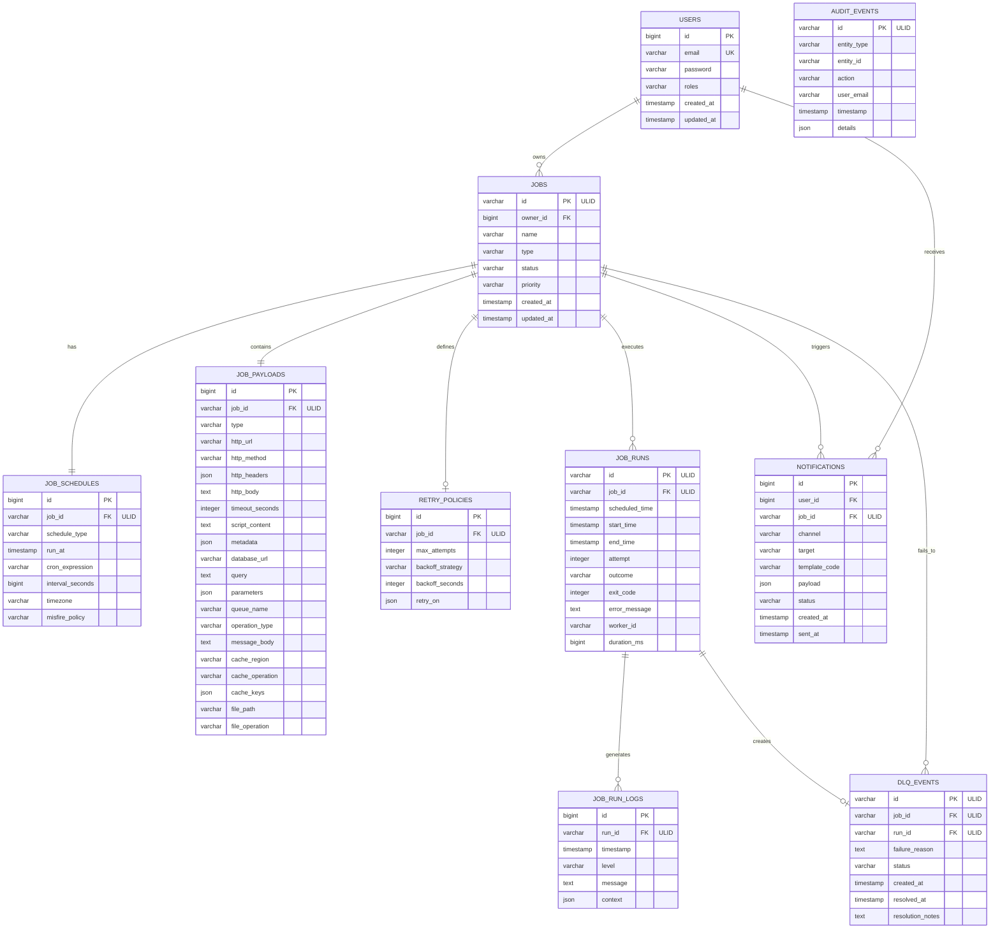

# 🗄️ Chronos Database Schema

## 📊 Entity Relationship Diagram (ERD)



## 📋 Table Definitions

### USERS Table
```sql
CREATE TABLE users (
    id BIGINT AUTO_INCREMENT PRIMARY KEY,
    email VARCHAR(255) NOT NULL UNIQUE,
    password VARCHAR(255) NOT NULL,
    roles VARCHAR(255) NOT NULL DEFAULT 'USER',
    created_at TIMESTAMP DEFAULT CURRENT_TIMESTAMP,
    updated_at TIMESTAMP DEFAULT CURRENT_TIMESTAMP ON UPDATE CURRENT_TIMESTAMP,
    
    INDEX idx_users_email (email),
    INDEX idx_users_created_at (created_at)
);
```

### JOBS Table
```sql
CREATE TABLE jobs (
    id VARCHAR(26) PRIMARY KEY COMMENT 'ULID',
    owner_id BIGINT NOT NULL,
    name VARCHAR(255) NOT NULL,
    type VARCHAR(50) NOT NULL,
    status VARCHAR(50) NOT NULL DEFAULT 'PENDING',
    priority VARCHAR(20) NOT NULL DEFAULT 'MEDIUM',
    created_at TIMESTAMP DEFAULT CURRENT_TIMESTAMP,
    updated_at TIMESTAMP DEFAULT CURRENT_TIMESTAMP ON UPDATE CURRENT_TIMESTAMP,
    
    FOREIGN KEY (owner_id) REFERENCES users(id) ON DELETE CASCADE,
    INDEX idx_jobs_owner (owner_id),
    INDEX idx_jobs_type (type),
    INDEX idx_jobs_status (status),
    INDEX idx_jobs_priority (priority),
    INDEX idx_jobs_created_at (created_at),
    
    CONSTRAINT chk_jobs_type CHECK (type IN ('HTTP', 'DATABASE', 'FILE_SYSTEM', 'MESSAGE_QUEUE', 'CACHE', 'EMAIL', 'REPORT', 'SCRIPT', 'DUMMY', 'DB_TO_KAFKA')),
    CONSTRAINT chk_jobs_status CHECK (status IN ('PENDING', 'SCHEDULED', 'RUNNING', 'SUCCEEDED', 'FAILED', 'CANCELLED', 'PAUSED')),
    CONSTRAINT chk_jobs_priority CHECK (priority IN ('LOW', 'MEDIUM', 'HIGH'))
);
```

### JOB_SCHEDULES Table
```sql
CREATE TABLE job_schedules (
    id BIGINT AUTO_INCREMENT PRIMARY KEY,
    job_id VARCHAR(26) NOT NULL UNIQUE,
    schedule_type VARCHAR(20) NOT NULL,
    run_at TIMESTAMP NULL,
    cron_expression VARCHAR(255) NULL,
    interval_seconds BIGINT NULL,
    timezone VARCHAR(50) DEFAULT 'UTC',
    misfire_policy VARCHAR(20) DEFAULT 'FIRE_NOW',
    
    FOREIGN KEY (job_id) REFERENCES jobs(id) ON DELETE CASCADE,
    INDEX idx_job_schedules_job_id (job_id),
    INDEX idx_job_schedules_run_at (run_at),
    INDEX idx_job_schedules_type (schedule_type),
    
    CONSTRAINT chk_schedule_type CHECK (schedule_type IN ('ONCE', 'CRON', 'INTERVAL')),
    CONSTRAINT chk_misfire_policy CHECK (misfire_policy IN ('FIRE_NOW', 'IGNORE', 'RESCHEDULE'))
);
```

### JOB_PAYLOADS Table
```sql
CREATE TABLE job_payloads (
    id BIGINT AUTO_INCREMENT PRIMARY KEY,
    job_id VARCHAR(26) NOT NULL UNIQUE,
    type VARCHAR(50) NOT NULL,
    
    -- HTTP Job Fields
    http_url VARCHAR(2048) NULL,
    http_method VARCHAR(10) NULL,
    http_headers JSON NULL,
    http_body TEXT NULL,
    timeout_seconds INTEGER NULL,
    
    -- Script Job Fields
    script_content TEXT NULL,
    
    -- Database Job Fields
    database_url VARCHAR(2048) NULL,
    query TEXT NULL,
    parameters JSON NULL,
    query_timeout_seconds INTEGER NULL,
    max_rows INTEGER NULL,
    read_only BOOLEAN DEFAULT TRUE,
    transaction_isolation VARCHAR(50) NULL,
    
    -- Message Queue Job Fields
    queue_name VARCHAR(255) NULL,
    operation_type VARCHAR(50) NULL,
    message_body TEXT NULL,
    message_group_id VARCHAR(255) NULL,
    queue_config JSON NULL,
    batch_size INTEGER NULL,
    
    -- Cache Job Fields
    cache_region VARCHAR(255) NULL,
    cache_operation VARCHAR(50) NULL,
    cache_keys JSON NULL,
    time_to_live_seconds INTEGER NULL,
    skip_if_exists BOOLEAN DEFAULT FALSE,
    source_region VARCHAR(255) NULL,
    cache_config JSON NULL,
    async BOOLEAN DEFAULT FALSE,
    
    -- File System Job Fields
    file_path VARCHAR(2048) NULL,
    file_operation VARCHAR(50) NULL,
    target_path VARCHAR(2048) NULL,
    file_content TEXT NULL,
    create_directories BOOLEAN DEFAULT FALSE,
    overwrite BOOLEAN DEFAULT FALSE,
    
    -- DB to Kafka Job Fields
    kafka_topic VARCHAR(255) NULL,
    kafka_key_field VARCHAR(255) NULL,
    include_metadata BOOLEAN DEFAULT FALSE,
    skip_on_error BOOLEAN DEFAULT FALSE,
    field_mappings JSON NULL,
    excluded_fields JSON NULL,
    
    -- Generic Fields
    metadata JSON NULL,
    
    FOREIGN KEY (job_id) REFERENCES jobs(id) ON DELETE CASCADE,
    INDEX idx_job_payloads_job_id (job_id),
    INDEX idx_job_payloads_type (type)
);
```

### RETRY_POLICIES Table
```sql
CREATE TABLE retry_policies (
    id BIGINT AUTO_INCREMENT PRIMARY KEY,
    job_id VARCHAR(26) NOT NULL UNIQUE,
    max_attempts INTEGER NOT NULL DEFAULT 1,
    backoff_strategy VARCHAR(20) NOT NULL DEFAULT 'FIXED',
    backoff_seconds INTEGER NOT NULL DEFAULT 60,
    retry_on JSON NULL,
    
    FOREIGN KEY (job_id) REFERENCES jobs(id) ON DELETE CASCADE,
    INDEX idx_retry_policies_job_id (job_id),
    
    CONSTRAINT chk_max_attempts CHECK (max_attempts > 0),
    CONSTRAINT chk_backoff_seconds CHECK (backoff_seconds >= 0),
    CONSTRAINT chk_backoff_strategy CHECK (backoff_strategy IN ('FIXED', 'EXPONENTIAL'))
);
```

### JOB_RUNS Table
```sql
CREATE TABLE job_runs (
    id VARCHAR(26) PRIMARY KEY COMMENT 'ULID',
    job_id VARCHAR(26) NOT NULL,
    scheduled_time TIMESTAMP NOT NULL,
    start_time TIMESTAMP NULL,
    end_time TIMESTAMP NULL,
    attempt INTEGER NOT NULL DEFAULT 1,
    outcome VARCHAR(20) NULL,
    exit_code INTEGER NULL,
    error_message TEXT NULL,
    worker_id VARCHAR(255) NULL,
    duration_ms BIGINT NULL,
    
    FOREIGN KEY (job_id) REFERENCES jobs(id) ON DELETE CASCADE,
    INDEX idx_job_runs_job_id (job_id),
    INDEX idx_job_runs_scheduled_time (scheduled_time),
    INDEX idx_job_runs_outcome (outcome),
    INDEX idx_job_runs_worker_id (worker_id),
    
    CONSTRAINT chk_outcome CHECK (outcome IN ('SUCCESS', 'FAILURE', 'TIMEOUT', 'CANCELLED'))
);
```

### JOB_RUN_LOGS Table
```sql
CREATE TABLE job_run_logs (
    id BIGINT AUTO_INCREMENT PRIMARY KEY,
    run_id VARCHAR(26) NOT NULL,
    timestamp TIMESTAMP NOT NULL DEFAULT CURRENT_TIMESTAMP,
    level VARCHAR(10) NOT NULL DEFAULT 'INFO',
    message TEXT NOT NULL,
    context JSON NULL,
    
    FOREIGN KEY (run_id) REFERENCES job_runs(id) ON DELETE CASCADE,
    INDEX idx_job_run_logs_run_id (run_id),
    INDEX idx_job_run_logs_timestamp (timestamp),
    INDEX idx_job_run_logs_level (level),
    
    CONSTRAINT chk_level CHECK (level IN ('TRACE', 'DEBUG', 'INFO', 'WARN', 'ERROR'))
);
```

### NOTIFICATIONS Table
```sql
CREATE TABLE notifications (
    id BIGINT AUTO_INCREMENT PRIMARY KEY,
    user_id BIGINT NOT NULL,
    job_id VARCHAR(26) NULL,
    channel VARCHAR(20) NOT NULL,
    target VARCHAR(255) NOT NULL,
    template_code VARCHAR(50) NOT NULL,
    payload JSON NULL,
    status VARCHAR(20) NOT NULL DEFAULT 'PENDING',
    created_at TIMESTAMP DEFAULT CURRENT_TIMESTAMP,
    sent_at TIMESTAMP NULL,
    
    FOREIGN KEY (user_id) REFERENCES users(id) ON DELETE CASCADE,
    FOREIGN KEY (job_id) REFERENCES jobs(id) ON DELETE SET NULL,
    INDEX idx_notifications_user_id (user_id),
    INDEX idx_notifications_job_id (job_id),
    INDEX idx_notifications_status (status),
    INDEX idx_notifications_created_at (created_at),
    
    CONSTRAINT chk_channel CHECK (channel IN ('EMAIL', 'WEBHOOK', 'SMS')),
    CONSTRAINT chk_notification_status CHECK (status IN ('PENDING', 'SENT', 'FAILED', 'CANCELLED'))
);
```

### DLQ_EVENTS Table
```sql
CREATE TABLE dlq_events (
    id VARCHAR(26) PRIMARY KEY COMMENT 'ULID',
    job_id VARCHAR(26) NOT NULL,
    run_id VARCHAR(26) NULL,
    failure_reason TEXT NOT NULL,
    status VARCHAR(20) NOT NULL DEFAULT 'PENDING',
    created_at TIMESTAMP DEFAULT CURRENT_TIMESTAMP,
    resolved_at TIMESTAMP NULL,
    resolution_notes TEXT NULL,
    
    FOREIGN KEY (job_id) REFERENCES jobs(id) ON DELETE CASCADE,
    FOREIGN KEY (run_id) REFERENCES job_runs(id) ON DELETE SET NULL,
    INDEX idx_dlq_events_job_id (job_id),
    INDEX idx_dlq_events_run_id (run_id),
    INDEX idx_dlq_events_status (status),
    INDEX idx_dlq_events_created_at (created_at),
    
    CONSTRAINT chk_dlq_status CHECK (status IN ('PENDING', 'RESOLVED', 'IGNORED'))
);
```

### AUDIT_EVENTS Table
```sql
CREATE TABLE audit_events (
    id VARCHAR(26) PRIMARY KEY COMMENT 'ULID',
    entity_type VARCHAR(50) NOT NULL,
    entity_id VARCHAR(255) NOT NULL,
    action VARCHAR(50) NOT NULL,
    user_email VARCHAR(255) NULL,
    timestamp TIMESTAMP DEFAULT CURRENT_TIMESTAMP,
    details JSON NULL,
    
    INDEX idx_audit_events_entity (entity_type, entity_id),
    INDEX idx_audit_events_user (user_email),
    INDEX idx_audit_events_timestamp (timestamp),
    INDEX idx_audit_events_action (action)
);
```

## 🔍 Database Indexes

### Performance Indexes
```sql
-- Job query optimization
CREATE INDEX idx_jobs_composite_status_type ON jobs(status, type, created_at);
CREATE INDEX idx_jobs_composite_owner_status ON jobs(owner_id, status, updated_at);

-- Job run performance
CREATE INDEX idx_job_runs_composite_job_time ON job_runs(job_id, scheduled_time DESC);
CREATE INDEX idx_job_runs_composite_outcome_time ON job_runs(outcome, end_time DESC);

-- Audit performance
CREATE INDEX idx_audit_events_composite_entity_time ON audit_events(entity_type, entity_id, timestamp DESC);

-- Notification performance
CREATE INDEX idx_notifications_composite_user_status ON notifications(user_id, status, created_at DESC);
```

## 🔧 Database Constraints

### Data Integrity
```sql
-- Ensure schedule consistency
ALTER TABLE job_schedules 
ADD CONSTRAINT chk_schedule_consistency 
CHECK (
    (schedule_type = 'ONCE' AND run_at IS NOT NULL) OR
    (schedule_type = 'CRON' AND cron_expression IS NOT NULL) OR
    (schedule_type = 'INTERVAL' AND interval_seconds IS NOT NULL)
);

-- Ensure payload type matches job type
ALTER TABLE job_payloads 
ADD CONSTRAINT chk_payload_type_consistency 
CHECK (type IN (SELECT DISTINCT type FROM jobs));

-- Ensure retry policy sanity
ALTER TABLE retry_policies 
ADD CONSTRAINT chk_retry_sanity 
CHECK (max_attempts BETWEEN 1 AND 10 AND backoff_seconds BETWEEN 0 AND 3600);
```

## 📊 Database Views

### Job Summary View
```sql
CREATE VIEW job_summary AS
SELECT 
    j.id,
    j.name,
    j.type,
    j.status,
    j.priority,
    u.email as owner_email,
    js.schedule_type,
    js.run_at,
    js.cron_expression,
    COUNT(jr.id) as total_runs,
    MAX(jr.end_time) as last_run_time,
    AVG(jr.duration_ms) as avg_duration_ms
FROM jobs j
LEFT JOIN users u ON j.owner_id = u.id
LEFT JOIN job_schedules js ON j.id = js.job_id
LEFT JOIN job_runs jr ON j.id = jr.job_id
GROUP BY j.id, j.name, j.type, j.status, j.priority, u.email, js.schedule_type, js.run_at, js.cron_expression;
```

### Execution Statistics View
```sql
CREATE VIEW execution_stats AS
SELECT 
    DATE(jr.scheduled_time) as execution_date,
    j.type as job_type,
    jr.outcome,
    COUNT(*) as execution_count,
    AVG(jr.duration_ms) as avg_duration_ms,
    MIN(jr.duration_ms) as min_duration_ms,
    MAX(jr.duration_ms) as max_duration_ms
FROM job_runs jr
JOIN jobs j ON jr.job_id = j.id
WHERE jr.end_time IS NOT NULL
GROUP BY DATE(jr.scheduled_time), j.type, jr.outcome;
```
