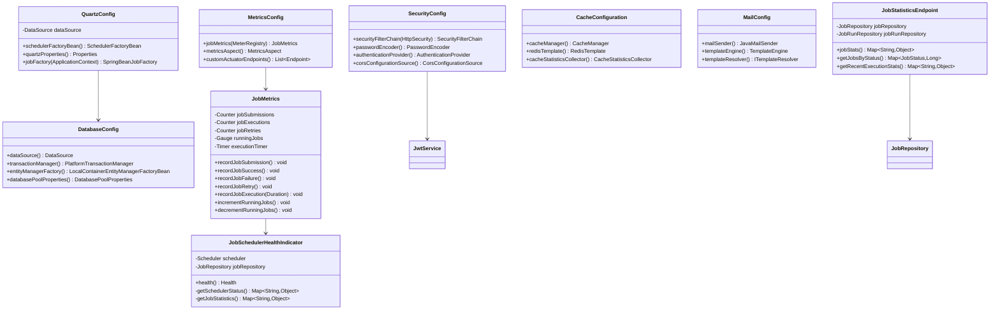

# 🏗️ Chronos UML Class Diagrams

## 📦 Domain Model Class Diagram

```mermaid
classDiagram
    class User {
        -Long id
        -String email
        -String password
        -Set~Role~ roles
        -Instant createdAt
        -Instant updatedAt
        +getAuthorities() Collection~GrantedAuthority~
        +getUsername() String
        +isAccountNonExpired() boolean
        +isAccountNonLocked() boolean
        +isCredentialsNonExpired() boolean
        +isEnabled() boolean
    }

    class Job {
        -String id
        -User owner
        -String name
        -JobType type
        -JobStatus status
        -JobPriority priority
        -JobSchedule schedule
        -JobPayload payload
        -RetryPolicy retryPolicy
        -List~JobRun~ runs
        -List~Notification~ notifications
        -Instant createdAt
        -Instant updatedAt
        +getId() String
        +setStatus(JobStatus) void
        +addRun(JobRun) void
    }

    class JobSchedule {
        -Long id
        -ScheduleType scheduleType
        -Instant runAt
        -String cronExpression
        -Long intervalSeconds
        -String timezone
        -MisfirePolicy misfirePolicy
        +getNextExecutionTime() Instant
        +isRecurring() boolean
    }

    class JobPayload {
        <<abstract>>
        -Long id
        -String type
        -Map~String,Object~ metadata
        +validate() void
        +getExecutionParameters() Map~String,Object~
    }

    class HttpJobPayload {
        -String httpUrl
        -String httpMethod
        -Map~String,String~ httpHeaders
        -String httpBody
        -Integer timeoutSeconds
        +buildRequest() HttpRequest
        +validate() void
    }

    class DatabaseJobPayload {
        -String databaseUrl
        -String query
        -Map~String,Object~ parameters
        -String transactionIsolation
        -Integer queryTimeoutSeconds
        -Integer maxRows
        -Boolean readOnly
        +getDataSource() DataSource
        +validate() void
    }

    class MessageQueueJobPayload {
        -String queueName
        -String operationType
        -String messageBody
        -String messageGroupId
        -Map~String,Object~ queueConfig
        -Integer batchSize
        +getQueueConfiguration() QueueConfig
        +validate() void
    }

    class RetryPolicy {
        -Long id
        -Integer maxAttempts
        -BackoffStrategy backoffStrategy
        -Integer backoffSeconds
        -List~String~ retryOn
        +shouldRetry(Exception) boolean
        +getNextRetryDelay(int) Duration
    }

    class JobRun {
        -String id
        -Job job
        -Instant scheduledTime
        -Instant startTime
        -Instant endTime
        -Integer attempt
        -JobOutcome outcome
        -Integer exitCode
        -String errorMessage
        -String workerId
        -Long durationMs
        -List~JobRunLog~ logs
        +isCompleted() boolean
        +getDuration() Duration
        +addLog(String,String) void
    }

    class JobRunLog {
        -Long id
        -String runId
        -Instant timestamp
        -String level
        -String message
        -Map~String,Object~ context
        +getFormattedMessage() String
    }

    class Notification {
        -Long id
        -User user
        -Job job
        -NotificationChannel channel
        -String target
        -String templateCode
        -Map~String,Object~ payload
        -NotificationStatus status
        -Instant createdAt
        -Instant sentAt
        +send() void
        +markAsSent() void
    }

    class DLQEvent {
        -String id
        -Job job
        -JobRun run
        -String failureReason
        -DLQStatus status
        -Instant createdAt
        -Instant resolvedAt
        -String resolutionNotes
        +resolve(String) void
        +replay() void
    }

    class AuditEvent {
        -String id
        -String entityType
        -String entityId
        -String action
        -String userEmail
        -Instant timestamp
        -Map~String,Object~ details
        +getEntityReference() String
    }

    %% Enums
    class JobType {
        <<enumeration>>
        HTTP
        DATABASE
        FILE_SYSTEM
        MESSAGE_QUEUE
        CACHE
        EMAIL
        REPORT
        SCRIPT
        DUMMY
        DB_TO_KAFKA
    }

    class JobStatus {
        <<enumeration>>
        PENDING
        SCHEDULED
        RUNNING
        SUCCEEDED
        FAILED
        CANCELLED
        PAUSED
    }

    class JobPriority {
        <<enumeration>>
        LOW
        MEDIUM
        HIGH
    }

    class ScheduleType {
        <<enumeration>>
        ONCE
        CRON
        INTERVAL
    }

    class JobOutcome {
        <<enumeration>>
        SUCCESS
        FAILURE
        TIMEOUT
        CANCELLED
    }

    %% Relationships
    User ||--o{ Job : owns
    Job ||--|| JobSchedule : has
    Job ||--|| JobPayload : contains
    Job ||--o| RetryPolicy : defines
    Job ||--o{ JobRun : executes
    Job ||--o{ Notification : triggers
    Job ||--o{ DLQEvent : fails
    JobRun ||--o{ JobRunLog : generates
    JobRun ||--o| DLQEvent : creates
    User ||--o{ Notification : receives
    
    JobPayload <|-- HttpJobPayload
    JobPayload <|-- DatabaseJobPayload
    JobPayload <|-- MessageQueueJobPayload
    
    Job --> JobType
    Job --> JobStatus
    Job --> JobPriority
    JobSchedule --> ScheduleType
    JobRun --> JobOutcome
```

## 🔧 Service Layer Class Diagram


## 🌐 API Layer Class Diagram


## 🔧 Configuration & Infrastructure


