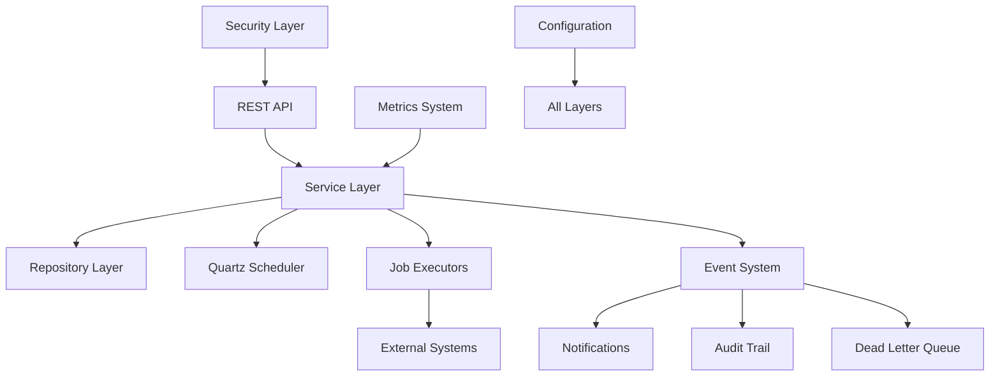
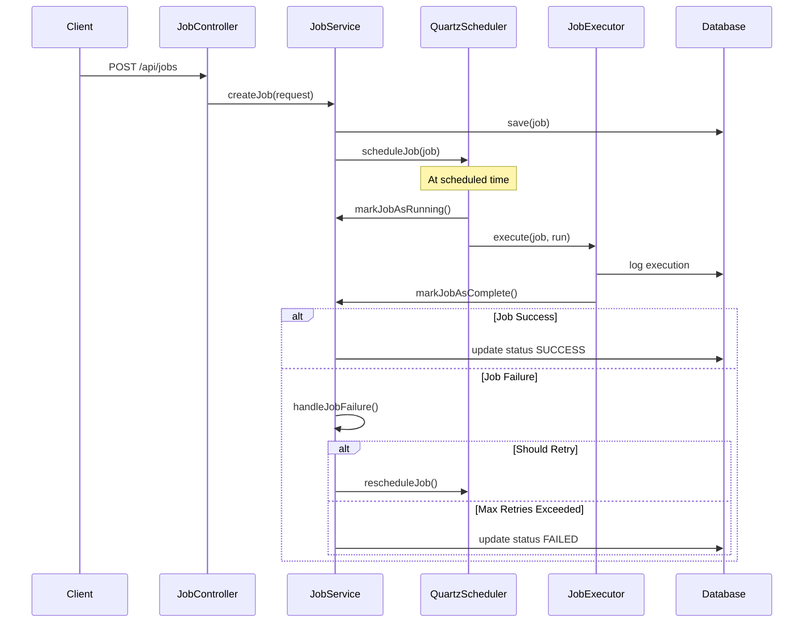

# Chronos Job Scheduling System - Architecture Overview

## System Architecture Summary

The Chronos job scheduling system follows a **layered architecture** with clear separation of concerns, implementing enterprise-grade patterns for scalability, security, and maintainability.

## Architectural Layers

### 1. **API Layer** (`com.chronos.api`)
- **Controllers**: REST endpoints for job management, authentication, notifications
- **DTOs**: Data transfer objects with validation annotations
- **Mappers**: MapStruct converters between entities and DTOs
- **Error Handling**: Global exception handler with RFC 7807 compliance

### 2. **Service Layer** (`com.chronos.service`)
- **Business Logic**: Core job lifecycle management and orchestration
- **Job Executors**: Specialized executors for different job types
- **Scheduler Integration**: Quartz scheduler service for job timing
- **Cross-cutting Concerns**: Notifications, audit, DLQ management

### 3. **Domain Layer** (`com.chronos.domain`)
- **Entities**: JPA entities representing core business objects
- **Enums**: Type-safe enumeration for job states and configurations
- **Payload Hierarchy**: Polymorphic job configuration storage

### 4. **Repository Layer** (`com.chronos.repository`)
- **Data Access**: Spring Data JPA repositories
- **Custom Queries**: Optimized queries for job management operations
- **Transaction Management**: Proper isolation and consistency

### 5. **Infrastructure Layer**
- **Configuration**: Spring configuration classes
- **Security**: JWT authentication and authorization
- **Monitoring**: Metrics collection and health indicators
- **Scheduling**: Quartz integration with clustering support

## Key Design Patterns

### 1. **Strategy Pattern**
```java
interface JobTypeExecutor {
    void execute(Job job, JobRun run);
    void validate(JobPayload payload);
}

// Implementations: HttpJobExecutor, DatabaseJobExecutor, etc.
```

### 2. **Repository Pattern**
```java
interface JobRepository extends JpaRepository<Job, String> {
    Page<Job> findByOwnerAndStatus(User owner, JobStatus status, Pageable pageable);
    // Custom query methods
}
```

### 3. **Builder Pattern**
```java
Job job = Job.builder()
    .id(UlidCreator.getUlid().toString())
    .name("Sample Job")
    .type(JobType.HTTP)
    .status(JobStatus.PENDING)
    .build();
```

### 4. **Factory Pattern**
```java
class JobExecutorServiceImpl {
    private JobTypeExecutor getExecutorForJobType(JobType type) {
        return switch (type) {
            case HTTP -> httpJobExecutor;
            case DATABASE -> databaseJobExecutor;
            // ... other types
        };
    }
}
```

### 5. **Observer Pattern**
```java
@EventListener
public void handleJobFailure(JobFailureEvent event) {
    // Handle job failure notifications and DLQ
}
```

### 6. **Template Method Pattern**
```java
abstract class JobTypeExecutor {
    public final void execute(Job job, JobRun run) {
        preExecute(job, run);
        doExecute(job, run);
        postExecute(job, run);
    }
    
    protected abstract void doExecute(Job job, JobRun run);
}
```

## Core Components Interaction



## Job Execution Flow



## Security Architecture

### Authentication Flow
1. **User Registration/Login** → JWT token generation
2. **Request Authentication** → JWT filter validates token
3. **Authorization** → Role-based access control
4. **Resource Protection** → Owner-based job access

### Security Components
- **JwtService**: Token generation and validation
- **JwtAuthenticationFilter**: Request interception
- **SecurityConfig**: Security policy configuration
- **User Entity**: UserDetails implementation

## Monitoring & Observability

### Metrics Collection
- **JobMetrics**: Direct metrics recording
- **MetricsAspect**: AOP-based metrics collection
- **Prometheus Integration**: Metrics export
- **Grafana Dashboards**: Visualization

### Health Monitoring
- **JobSchedulerHealthIndicator**: Scheduler status
- **Custom Actuator Endpoints**: Job statistics
- **Database Health**: Connection monitoring
- **Cluster Status**: Multi-instance coordination

## Data Flow Architecture

### Job Payload Polymorphism
```java
@Entity
@Inheritance(strategy = InheritanceType.SINGLE_TABLE)
@DiscriminatorColumn(name = "payload_type")
abstract class JobPayload {
    // Common fields
}

@DiscriminatorValue("HTTP")
class HttpJobPayload extends JobPayload {
    // HTTP-specific fields
}

@DiscriminatorValue("DATABASE")
class DatabaseJobPayload extends JobPayload {
    // Database-specific fields
}
```

### Repository Query Optimization
- **Strategic Indexing**: Performance-optimized queries
- **Pagination Support**: Large dataset handling
- **Custom Queries**: Business-specific operations
- **Transaction Isolation**: Data consistency

## Scalability Considerations

### Horizontal Scaling
- **Quartz Clustering**: Multi-instance job distribution
- **Stateless Services**: No server affinity required
- **Database Clustering**: High availability data layer
- **Load Balancing**: Request distribution

### Performance Optimization
- **Connection Pooling**: Database connection management
- **Async Processing**: Non-blocking operations
- **Caching Strategy**: Redis integration
- **Batch Operations**: Bulk data processing

## Error Handling Strategy

### Exception Hierarchy
```java
ChronosException (abstract)
├── JobExecutionException
├── InvalidJobConfigurationException
└── ResourceNotFoundException
```

### Error Recovery
- **Retry Policies**: Configurable failure handling
- **Dead Letter Queue**: Permanent failure management
- **Circuit Breaker**: Cascading failure prevention
- **Graceful Degradation**: Partial functionality maintenance

## Extension Points

### Adding New Job Types
1. Create new `JobPayload` subclass
2. Implement `JobTypeExecutor` interface
3. Add to `JobExecutorServiceImpl` switch statement
4. Update database constraints and migrations
5. Add validation and DTO mapping

### Custom Notification Channels
1. Implement `NotificationChannel` interface
2. Register in `NotificationService`
3. Add configuration properties
4. Update notification templates

## Production Deployment

### Infrastructure Requirements
- **Application Servers**: Spring Boot applications
- **Database**: MySQL 8.0+ with clustering
- **Message Broker**: Kafka for job streaming
- **Cache**: Redis for session and data caching
- **Monitoring**: Prometheus + Grafana stack
- **Load Balancer**: Nginx or cloud load balancer

### Configuration Management
- **Environment Profiles**: Development, staging, production
- **External Configuration**: Environment variables and config files
- **Secret Management**: Encrypted credentials and API keys
- **Feature Flags**: Runtime behavior modification

This architecture provides a robust, scalable, and maintainable job scheduling system suitable for enterprise production environments with comprehensive monitoring, security, and operational capabilities.
