# Chronos Job Scheduling System - Extended Class Diagram

## Monitoring & Metrics

## Security & Authentication

## Configuration Classes

```mermaid
classDiagram
    %% Configuration Classes
    class QuartzConfig {
        -DataSource dataSource
        +schedulerFactoryBean() SchedulerFactoryBean
        +quartzProperties() Properties
        +jobFactory(ApplicationContext) SpringBeanJobFactory
        -configureClusterProperties(Properties) void
        -configurePersistenceProperties(Properties) void
        -configureThreadPoolProperties(Properties) void
    }

    class DatabaseConfig {
        +dataSource() DataSource
        +transactionManager(EntityManagerFactory) PlatformTransactionManager
        +entityManagerFactory(DataSource) LocalContainerEntityManagerFactoryBean
        +jpaProperties() Properties
        -configureHikariCP(HikariConfig) void
        -configureJpaProperties(Properties) void
    }

    class CacheConfiguration {
        +cacheManager() CacheManager
        +redisTemplate() RedisTemplate~String,Object~
        +redisConnectionFactory() LettuceConnectionFactory
        +cacheResolver() CacheResolver
        -configureCacheProperties() RedisCacheConfiguration
    }

    class RestTemplateConfig {
        +restTemplate() RestTemplate
        +clientHttpRequestFactory() ClientHttpRequestFactory
        -configureTimeouts(ClientHttpRequestFactory) void
        -configureConnectionPooling(ClientHttpRequestFactory) void
    }

    class MailConfig {
        +javaMailSender() JavaMailSender
        +templateEngine() TemplateEngine
        +templateResolver() ClassLoaderTemplateResolver
        +messageSource() MessageSource
        -configureMailProperties(JavaMailSenderImpl) void
        -configureTemplateEngine(SpringTemplateEngine) void
    }

    class MetricsConfig {
        +meterRegistry() MeterRegistry
        +prometheusRegistry() PrometheusMeterRegistry
        +timedAspect(MeterRegistry) TimedAspect
        +countedAspect(MeterRegistry) CountedAspect
        -configureCommonTags(MeterRegistry) void
    }

    class WebConfig {
        +corsConfigurationSource() CorsConfigurationSource
        +messageConverters() List~HttpMessageConverter~
        +objectMapper() ObjectMapper
        +webMvcConfigurer() WebMvcConfigurer
        -configureCors(CorsConfiguration) void
        -configureObjectMapper(ObjectMapper) void
    }

    class OpenApiConfig {
        +openAPI() OpenAPI
        +groupedOpenApi() GroupedOpenApi
        -apiInfo() Info
        -securityScheme() SecurityScheme
        -securityRequirement() SecurityRequirement
    }

    %% Factory Classes
    class DatabaseJobDataSourceFactory {
        -Map~String,DataSource~ dataSourceCache
        +getDataSource(String) DataSource
        +createDataSource(String) DataSource
        +closeDataSource(String) void
        -parseConnectionString(String) Properties
        -configureDataSource(HikariConfig, Properties) void
    }

    class SpringBeanJobFactory {
        -ApplicationContext applicationContext
        +createJobInstance(TriggerFiredBundle) Object
        -autowireBean(Object) void
    }

    %% Relationships
    QuartzConfig --> SpringBeanJobFactory
    DatabaseConfig --> DataSource
    CacheConfiguration --> CacheManager
    RestTemplateConfig --> RestTemplate
    MailConfig --> JavaMailSender
    MetricsConfig --> MeterRegistry
    WebConfig --> ObjectMapper
    OpenApiConfig --> OpenAPI
    DatabaseJobDataSourceFactory --> DataSource
```

## Exception Handling

## Event System

## Validation System

This extended class diagram complements the main class diagram by showing:

1. **Monitoring & Metrics**: JobMetrics, MetricsAspect, health indicators, and statistics endpoints
2. **Security & Authentication**: JWT-based security, authentication filters, and user management
3. **Configuration**: Spring configuration classes for various components
4. **Exception Handling**: Custom exceptions and global error handling
5. **Event System**: Application events for job lifecycle management
6. **Validation**: Custom validators and validation annotations

Together, these diagrams provide a complete view of the Chronos job scheduling system's architecture, showing how all components interact to provide a robust, secure, and observable job scheduling platform.
