# Chronos Job Scheduling System - Class Diagram

## Overview
This document provides a comprehensive UML class diagram for the Chronos job scheduling system, showing all key classes, their relationships, methods, and architectural patterns.

## Core Domain Model

```mermaid
classDiagram
    %% Core Domain Entities
    class User {
        -Long id
        -String email
        -String passwordHash
        -String roles
        -Instant createdAt
        +getId() Long
        +getEmail() String
        +getRoles() String
        +getAuthorities() Collection~GrantedAuthority~
    }

    class Job {
        -String id
        -User owner
        -String name
        -JobType type
        -JobStatus status
        -JobPriority priority
        -Instant createdAt
        -Instant lastRunAt
        -Instant nextRunAt
        -String workerId
        -JobSchedule schedule
        -JobPayload payload
        -RetryPolicy retryPolicy
        +getId() String
        +getName() String
        +getType() JobType
        +getStatus() JobStatus
        +onCreate() void
    }

    class JobSchedule {
        -Long id
        -Job job
        -ScheduleType scheduleType
        -Instant runAt
        -String cronExpression
        -Long intervalSeconds
        -String timezone
        -MisfirePolicy misfirePolicy
        +getScheduleType() ScheduleType
        +getRunAt() Instant
        +getCronExpression() String
    }

    class JobPayload {
        <<abstract>>
        -Job job
        -String payloadType
        +getPayloadType() String
        +validate() void
    }

    class HttpJobPayload {
        -String httpUrl
        -String httpMethod
        -Map~String,String~ httpHeaders
        -String httpBody
        -Integer timeoutSeconds
        +getHttpUrl() String
        +getHttpMethod() String
        +validate() void
    }

    class DatabaseJobPayload {
        -String databaseUrl
        -String query
        -Map~String,Object~ parameters
        -String transactionIsolation
        -Integer queryTimeoutSeconds
        -Integer maxRows
        -Boolean readOnly
        +getDatabaseUrl() String
        +getQuery() String
        +validate() void
    }

    class MessageQueueJobPayload {
        -String operationType
        -String queueName
        -String messageBody
        -String messageGroupId
        -Map~String,Object~ messageAttributes
        -Map~String,Object~ queueConfig
        -Integer batchSize
        -Integer visibilityTimeoutSeconds
        +getOperationType() String
        +getQueueName() String
        +validate() void
    }

    class DbToKafkaJobPayload {
        -String databaseUrl
        -String query
        -String kafkaTopic
        -String kafkaKeyField
        -Map~String,String~ kafkaHeaders
        -String offsetField
        -String lastProcessedValue
        -Map~String,String~ fieldMappings
        -List~String~ excludeFields
        -Boolean includeMetadata
        -String deadLetterTopic
        -Boolean skipOnError
        -Integer maxRetries
        -Integer maxRecords
        -Integer connectionTimeoutSeconds
        +getDatabaseUrl() String
        +getKafkaTopic() String
        +validate() void
    }

    class RetryPolicy {
        -Job job
        -Integer maxAttempts
        -BackoffStrategy backoffStrategy
        -Integer backoffSeconds
        -List~String~ retryOn
        +getMaxAttempts() Integer
        +getBackoffStrategy() BackoffStrategy
        +shouldRetry() Boolean
    }

    class JobRun {
        -String id
        -Job job
        -Instant scheduledTime
        -Instant startTime
        -Instant endTime
        -Integer attempt
        -JobOutcome outcome
        -Integer exitCode
        -String errorMessage
        -String workerId
        -Long durationMs
        +getId() String
        +getAttempt() Integer
        +getOutcome() JobOutcome
        +calculateDuration() Long
    }

    class JobRunLog {
        -Long id
        -JobRun run
        -Instant timestamp
        -String level
        -String message
        -Map~String,Object~ context
        +getId() Long
        +getLevel() String
        +getMessage() String
    }

    %% Enums
    class JobType {
        <<enumeration>>
        HTTP
        SCRIPT
        DATABASE
        FILE_SYSTEM
        MESSAGE_QUEUE
        DB_TO_KAFKA
        CACHE
        REPORT
        DUMMY
    }

    class JobStatus {
        <<enumeration>>
        PENDING
        SCHEDULED
        RUNNING
        SUCCEEDED
        FAILED
        CANCELLED
        PAUSED
    }

    class JobPriority {
        <<enumeration>>
        LOW
        MEDIUM
        HIGH
        CRITICAL
    }

    class ScheduleType {
        <<enumeration>>
        ONCE
        CRON
        INTERVAL
    }

    class BackoffStrategy {
        <<enumeration>>
        FIXED
        EXPONENTIAL
    }

    class JobOutcome {
        <<enumeration>>
        SUCCESS
        FAILURE
    }

    %% Relationships
    User ||--o{ Job : owns
    Job ||--|| JobSchedule : has
    Job ||--|| JobPayload : has
    Job ||--o| RetryPolicy : has
    Job ||--o{ JobRun : executes
    JobRun ||--o{ JobRunLog : generates
    JobPayload <|-- HttpJobPayload
    JobPayload <|-- DatabaseJobPayload
    JobPayload <|-- MessageQueueJobPayload
    JobPayload <|-- DbToKafkaJobPayload
    Job --> JobType
    Job --> JobStatus
    Job --> JobPriority
    JobSchedule --> ScheduleType
    RetryPolicy --> BackoffStrategy
    JobRun --> JobOutcome
```

## Service Layer Architecture


## Repository Layer


## API Layer

```mermaid
classDiagram
    %% Controllers
    class JobController {
        -JobService jobService
        +createJob(CreateJobRequest) ResponseEntity~JobResponse~
        +getJob(String) ResponseEntity~JobResponse~
        +getJobs(JobStatus, String, Instant, Instant, Pageable) ResponseEntity~Page~
        +updateJob(String, CreateJobRequest) ResponseEntity~JobResponse~
        +deleteJob(String) ResponseEntity~Void~
        +scheduleJob(String, Instant) ResponseEntity~JobResponse~
        +cancelJob(String) ResponseEntity~JobResponse~
        +pauseJob(String) ResponseEntity~JobResponse~
        +resumeJob(String) ResponseEntity~JobResponse~
        +triggerJobNow(String) ResponseEntity~JobResponse~
        +getJobRuns(String, Pageable) ResponseEntity~Page~
        +getJobRun(String, String) ResponseEntity~JobRunSummaryDto~
        +getJobRunLogs(String, String, Pageable) ResponseEntity~Page~
    }

    class AuthController {
        -AuthenticationService authService
        +register(RegisterRequest) ResponseEntity~AuthResponse~
        +login(LoginRequest) ResponseEntity~AuthResponse~
        +refreshToken(RefreshTokenRequest) ResponseEntity~AuthResponse~
    }

    class NotificationController {
        -NotificationService notificationService
        +getNotifications(Pageable) ResponseEntity~Page~
        +markAsRead(Long) ResponseEntity~Void~
        +updateSettings(NotificationSettingsRequest) ResponseEntity~Void~
    }

    class DLQController {
        -DLQService dlqService
        +getDLQEvents(Pageable) ResponseEntity~Page~
        +replayJob(Long) ResponseEntity~Void~
        +resolveEvent(Long) ResponseEntity~Void~
    }

    class AuditController {
        -AuditService auditService
        +getAuditEvents(String, Pageable) ResponseEntity~Page~
        +getEntityHistory(String, String) ResponseEntity~List~
    }

    %% DTOs
    class CreateJobRequest {
        -String name
        -JobType type
        -JobPriority priority
        -JobScheduleDto schedule
        -JobPayloadDto payload
        -RetryPolicyDto retryPolicy
        +getName() String
        +getType() JobType
        +validate() void
    }

    class JobResponse {
        -String id
        -String name
        -JobType type
        -JobStatus status
        -JobPriority priority
        -String ownerEmail
        -Instant createdAt
        -JobScheduleDto schedule
        -JobPayloadDto payload
        -RetryPolicyDto retryPolicy
        +getId() String
        +getStatus() JobStatus
    }

    class JobRunSummaryDto {
        -String id
        -String jobId
        -Instant scheduledTime
        -Instant startTime
        -Instant endTime
        -Integer attempt
        -JobOutcome outcome
        -String errorMessage
        -String workerId
        -Long durationMs
        +getId() String
        +getOutcome() JobOutcome
    }

    %% Mappers
    class JobMapper {
        <<interface>>
        +toJob(CreateJobRequest) Job
        +toJobResponse(Job) JobResponse
        +toJobRunSummaryDto(JobRun) JobRunSummaryDto
        +updateJobFromRequest(Job, CreateJobRequest) void
    }

    %% Relationships
    JobController --> JobService
    JobController --> CreateJobRequest
    JobController --> JobResponse
    AuthController --> AuthenticationService
    NotificationController --> NotificationService
    DLQController --> DLQService
    AuditController --> AuditService
    JobMapper --> Job
    JobMapper --> JobResponse
```



This comprehensive class diagram shows the complete architecture of the Chronos job scheduling system, including:

1. **Domain Model**: Core entities with their relationships and methods
2. **Service Layer**: Business logic interfaces and implementations
3. **Repository Layer**: Data access layer with Spring Data JPA
4. **API Layer**: REST controllers, DTOs, and mappers
5. **Job Executors**: Specialized executors for different job types

The diagram demonstrates key architectural patterns like:
- **Layered Architecture**: Clear separation between API, Service, and Repository layers
- **Strategy Pattern**: JobTypeExecutor interface with multiple implementations
- **Repository Pattern**: Data access abstraction
- **DTO Pattern**: Data transfer objects for API communication
- **Dependency Injection**: Service dependencies managed by Spring
- **Polymorphism**: JobPayload hierarchy for different job types
