# Chronos Job Scheduling System - Database ER Diagram

## Overview
This document provides a comprehensive Entity-Relationship (ER) diagram for the Chronos job scheduling system database, including all tables, relationships, and constraints.

## Database Schema Diagram

```mermaid
erDiagram
    %% Core User Management
    USERS {
        bigint id PK "AUTO_INCREMENT"
        varchar email UK "NOT NULL, UNIQUE"
        varchar password_hash "NOT NULL"
        varchar roles "NOT NULL"
        timestamp created_at "DEFAULT CURRENT_TIMESTAMP"
    }

    %% Core Job Management
    JOBS {
        varchar id PK "ULID, 26 chars"
        bigint owner_id FK "NOT NULL"
        varchar name "NOT NULL"
        varchar type "NOT NULL, CHECK constraint"
        varchar status "NOT NULL, CHECK constraint"
        smallint priority "DEFAULT 0"
        timestamp created_at "DEFAULT CURRENT_TIMESTAMP"
        timestamp next_run_at "NULL"
    }

    %% Job Scheduling Configuration
    JOB_SCHEDULES {
        bigint id PK "AUTO_INCREMENT"
        varchar job_id FK "NOT NULL, UNIQUE"
        varchar schedule_type "NOT NULL, CHECK(ONCE|CRON|INTERVAL)"
        timestamp run_at "NULL"
        varchar cron_expr "NULL"
        bigint interval_seconds "NULL"
        varchar timezone "DEFAULT UTC"
        varchar misfire_policy "NOT NULL, CHECK constraint"
    }

    %% Job Payload Configuration (Polymorphic)
    JOB_PAYLOADS {
        varchar job_id PK "FK to jobs"
        varchar payload_type "NOT NULL, CHECK constraint"
        
        %% HTTP Job Fields
        text http_url "NULL"
        varchar http_method "NULL"
        json http_headers "NULL"
        text http_body "NULL"
        
        %% Script Job Fields
        text script "NULL"
        
        %% Cache Job Fields
        varchar region "NULL"
        varchar source_region "NULL"
        int time_to_live_seconds "NULL"
        boolean skip_if_exists "NULL"
        boolean async "NULL"
        json cache_config "NULL"
        json cache_keys "NULL"
        
        %% File System Job Fields
        text path "NULL"
        varchar operation "NULL"
        text content "NULL"
        text target_path "NULL"
        boolean create_directories "NULL"
        boolean overwrite "NULL"
        json parameters "NULL"
        
        %% Message Queue Job Fields
        varchar queue_name "NULL"
        text message "NULL"
        varchar routing_key "NULL"
        varchar exchange "NULL"
        int priority "NULL"
        boolean persistent "NULL"
        json headers "NULL"
        varchar operation_type "NULL"
        text message_body "NULL"
        varchar message_group_id "NULL"
        varchar message_deduplication_id "NULL"
        json message_attributes "NULL"
        json queue_config "NULL"
        int batch_size "NULL"
        int visibility_timeout_seconds "NULL"
        
        %% Database Job Fields
        varchar database_url "NULL"
        text sql_query "NULL"
        json query_parameters "NULL"
        varchar transaction_isolation "NULL"
        int query_timeout_seconds "NULL"
        int max_rows "NULL"
        boolean read_only "NULL"
        
        %% DB_TO_KAFKA Job Fields
        varchar kafka_topic "NULL"
        varchar kafka_key_field "NULL"
        json kafka_headers "NULL"
        varchar offset_field "NULL"
        varchar last_processed_value "NULL"
        json field_mappings "NULL"
        json exclude_fields "NULL"
        boolean include_metadata "DEFAULT TRUE"
        varchar dead_letter_topic "NULL"
        boolean skip_on_error "DEFAULT FALSE"
        int max_retries "DEFAULT 3"
        int max_records "NULL"
        int connection_timeout_seconds "DEFAULT 30"
        
        %% Report Job Fields
        varchar report_type "NULL"
        json recipients "NULL"
        varchar format "NULL"
        
        %% Common Fields
        json metadata "NULL"
    }

    %% Retry Policy Configuration
    RETRY_POLICIES {
        varchar job_id PK "FK to jobs"
        int max_attempts "DEFAULT 3"
        varchar backoff_strategy "NOT NULL, CHECK(FIXED|EXPONENTIAL)"
        int backoff_seconds "DEFAULT 60"
        json retry_on "DEFAULT conditions array"
    }

    %% Job Execution History
    JOB_RUNS {
        varchar id PK "ULID, 26 chars"
        varchar job_id FK "NOT NULL"
        timestamp scheduled_time "NOT NULL"
        timestamp start_time "NULL"
        timestamp end_time "NULL"
        int attempt "DEFAULT 1"
        varchar outcome "NULL, CHECK(SUCCESS|FAILURE)"
        int exit_code "NULL"
        text error_message "NULL"
        varchar worker_id "NULL"
        bigint duration_ms "NULL"
    }

    %% Job Execution Logs
    JOB_RUN_LOGS {
        bigint id PK "AUTO_INCREMENT"
        varchar run_id FK "NOT NULL"
        timestamp timestamp "DEFAULT CURRENT_TIMESTAMP"
        varchar level "NOT NULL"
        text message "NOT NULL"
        json context "NULL"
    }

    %% Notification System
    NOTIFICATIONS {
        bigint id PK "AUTO_INCREMENT"
        varchar job_id FK "NOT NULL"
        bigint user_id FK "NOT NULL"
        varchar channel "NOT NULL, CHECK(EMAIL|WEBHOOK)"
        text target "NOT NULL"
        varchar template_code "NOT NULL"
        timestamp sent_at "NULL"
        json payload "NULL"
    }

    %% Dead Letter Queue
    DLQ_EVENTS {
        bigint id PK "AUTO_INCREMENT"
        varchar job_id FK "NOT NULL"
        varchar last_run_id FK "NOT NULL"
        text reason "NOT NULL"
        timestamp created_at "DEFAULT CURRENT_TIMESTAMP"
    }

    %% Audit Trail
    AUDIT_EVENTS {
        bigint id PK "AUTO_INCREMENT"
        bigint user_id FK "NULL"
        varchar action "NOT NULL"
        varchar entity_type "NOT NULL"
        varchar entity_id "NOT NULL"
        timestamp created_at "DEFAULT CURRENT_TIMESTAMP"
        json details "NULL"
    }

    %% Quartz Scheduler Tables
    QRTZ_JOB_DETAILS {
        varchar sched_name PK "NOT NULL"
        varchar job_name PK "NOT NULL"
        varchar job_group PK "NOT NULL"
        varchar description "NULL"
        varchar job_class_name "NOT NULL"
        boolean is_durable "NOT NULL"
        boolean is_nonconcurrent "NOT NULL"
        boolean is_update_data "NOT NULL"
        boolean requests_recovery "NOT NULL"
        blob job_data "NULL"
    }

    QRTZ_TRIGGERS {
        varchar sched_name PK "NOT NULL"
        varchar trigger_name PK "NOT NULL"
        varchar trigger_group PK "NOT NULL"
        varchar job_name FK "NOT NULL"
        varchar job_group FK "NOT NULL"
        varchar description "NULL"
        bigint next_fire_time "NULL"
        bigint prev_fire_time "NULL"
        int priority "NULL"
        varchar trigger_state "NOT NULL"
        varchar trigger_type "NOT NULL"
        bigint start_time "NOT NULL"
        bigint end_time "NULL"
        varchar calendar_name "NULL"
        smallint misfire_instr "NULL"
        blob job_data "NULL"
    }

    QRTZ_CRON_TRIGGERS {
        varchar sched_name PK "NOT NULL"
        varchar trigger_name PK "NOT NULL"
        varchar trigger_group PK "NOT NULL"
        varchar cron_expression "NOT NULL"
        varchar time_zone_id "NULL"
    }

    QRTZ_SIMPLE_TRIGGERS {
        varchar sched_name PK "NOT NULL"
        varchar trigger_name PK "NOT NULL"
        varchar trigger_group PK "NOT NULL"
        bigint repeat_count "NOT NULL"
        bigint repeat_interval "NOT NULL"
        bigint times_triggered "NOT NULL"
    }

    QRTZ_FIRED_TRIGGERS {
        varchar sched_name PK "NOT NULL"
        varchar entry_id PK "NOT NULL"
        varchar trigger_name "NOT NULL"
        varchar trigger_group "NOT NULL"
        varchar instance_name "NOT NULL"
        bigint fired_time "NOT NULL"
        bigint sched_time "NOT NULL"
        int priority "NOT NULL"
        varchar state "NOT NULL"
        varchar job_name "NULL"
        varchar job_group "NULL"
        boolean is_nonconcurrent "NULL"
        boolean requests_recovery "NULL"
    }

    QRTZ_SCHEDULER_STATE {
        varchar sched_name PK "NOT NULL"
        varchar instance_name PK "NOT NULL"
        bigint last_checkin_time "NOT NULL"
        bigint checkin_interval "NOT NULL"
    }

    QRTZ_LOCKS {
        varchar sched_name PK "NOT NULL"
        varchar lock_name PK "NOT NULL"
    }

    %% Relationships
    USERS ||--o{ JOBS : "owns"
    USERS ||--o{ NOTIFICATIONS : "receives"
    USERS ||--o{ AUDIT_EVENTS : "performs"
    
    JOBS ||--|| JOB_SCHEDULES : "has"
    JOBS ||--|| JOB_PAYLOADS : "has"
    JOBS ||--o| RETRY_POLICIES : "has"
    JOBS ||--o{ JOB_RUNS : "executes"
    JOBS ||--o{ NOTIFICATIONS : "triggers"
    JOBS ||--o{ DLQ_EVENTS : "fails_to"
    
    JOB_RUNS ||--o{ JOB_RUN_LOGS : "generates"
    JOB_RUNS ||--o{ DLQ_EVENTS : "last_run"
    
    %% Quartz Relationships
    QRTZ_JOB_DETAILS ||--o{ QRTZ_TRIGGERS : "scheduled_by"
    QRTZ_TRIGGERS ||--o| QRTZ_CRON_TRIGGERS : "cron_config"
    QRTZ_TRIGGERS ||--o| QRTZ_SIMPLE_TRIGGERS : "simple_config"
```

## Table Descriptions

### Core Tables

#### USERS
- **Purpose**: User authentication and authorization
- **Key Features**: Email-based authentication, role-based access control
- **Relationships**: Owns jobs, receives notifications, performs audited actions

#### JOBS
- **Purpose**: Core job definitions and metadata
- **Key Features**: ULID primary keys, owner-based security, status tracking
- **Job Types**: HTTP, SCRIPT, DUMMY, CACHE, FILE_SYSTEM, MESSAGE_QUEUE, DATABASE, DB_TO_KAFKA, REPORT
- **Job Status**: PENDING, SCHEDULED, RUNNING, SUCCEEDED, FAILED, CANCELLED, PAUSED

#### JOB_SCHEDULES
- **Purpose**: Job timing and scheduling configuration
- **Schedule Types**: ONCE (one-time), CRON (cron expression), INTERVAL (fixed interval)
- **Misfire Policies**: FIRE_NOW, IGNORE, RESCHEDULE

#### JOB_PAYLOADS
- **Purpose**: Polymorphic job configuration storage
- **Design**: Single table with type-specific columns (NULL for non-applicable types)
- **Supported Types**: All job types with their specific configuration fields

#### RETRY_POLICIES
- **Purpose**: Failure handling and retry configuration
- **Backoff Strategies**: FIXED, EXPONENTIAL
- **Retry Conditions**: Configurable error types to retry on

### Execution Tables

#### JOB_RUNS
- **Purpose**: Individual job execution tracking
- **Key Features**: Attempt numbering, timing, outcome tracking, worker identification
- **Outcomes**: SUCCESS, FAILURE

#### JOB_RUN_LOGS
- **Purpose**: Detailed execution logging
- **Log Levels**: DEBUG, INFO, WARN, ERROR
- **Context**: JSON storage for structured log data

### Operational Tables

#### NOTIFICATIONS
- **Purpose**: User notification system
- **Channels**: EMAIL, WEBHOOK
- **Templates**: Configurable notification templates

#### DLQ_EVENTS
- **Purpose**: Dead Letter Queue for failed jobs
- **Usage**: Jobs that exceed retry limits or encounter permanent failures

#### AUDIT_EVENTS
- **Purpose**: System audit trail
- **Scope**: User actions, system events, security events

### Quartz Scheduler Tables

#### QRTZ_* Tables
- **Purpose**: Quartz scheduler persistence
- **Features**: Clustered scheduling, trigger management, job state persistence
- **Key Tables**: JOB_DETAILS, TRIGGERS, CRON_TRIGGERS, SIMPLE_TRIGGERS, FIRED_TRIGGERS, SCHEDULER_STATE, LOCKS

## Key Design Patterns

### 1. Polymorphic Job Payloads
- Single table inheritance pattern for job configurations
- Type-specific columns with NULL values for non-applicable types
- Enables flexible job type extension without schema changes

### 2. ULID Primary Keys
- Time-ordered, globally unique identifiers
- Better performance than UUIDs for primary keys
- Sortable by creation time

### 3. Audit Trail
- Comprehensive logging of all user actions
- JSON details for flexible audit data storage
- User attribution for security and compliance

### 4. Retry Mechanism
- Configurable retry policies per job
- Multiple backoff strategies (fixed, exponential)
- Condition-based retry logic

### 5. Dead Letter Queue
- Automatic handling of permanently failed jobs
- Preserves failure context for debugging
- Enables manual job replay functionality

## Indexes and Performance

### Primary Indexes
- All tables have appropriate primary keys
- Foreign key constraints ensure referential integrity

### Secondary Indexes
- `idx_jobs_owner_status`: Job queries by owner and status
- `idx_jobs_status`: System-wide job status queries
- `idx_job_runs_job_id`: Job run history queries
- `idx_job_runs_scheduled_time`: Time-based job run queries
- `idx_job_run_logs_run_id`: Log retrieval by run
- `idx_notifications_job_id`: Notification queries by job
- `idx_dlq_events_job_id`: DLQ queries by job
- `idx_audit_events_user_id`: Audit queries by user
- `idx_audit_events_created_at`: Time-based audit queries

## Constraints and Validation

### Check Constraints
- Job types and statuses validated at database level
- Schedule types and misfire policies enforced
- Notification channels restricted to supported types
- Retry backoff strategies validated

### Foreign Key Constraints
- Referential integrity maintained across all relationships
- Cascade delete policies where appropriate
- Orphan prevention for critical relationships

### Unique Constraints
- Job names unique per owner
- Job schedules one-to-one with jobs
- User emails globally unique

This ER diagram represents a production-ready job scheduling system with comprehensive features for enterprise use, including security, audit trails, retry mechanisms, and flexible job type support.
